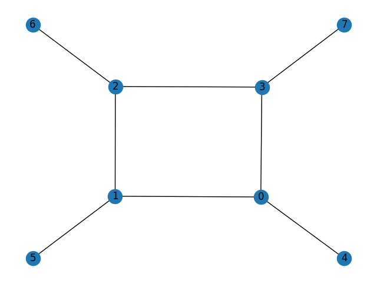

# Graph Drawing by Force-directed Placement

## About
This project is a python implementation of a graph drawing algorithm from an article ***Graph Drawing by Force-directed Placement***, originally published by _Thomas M. J. Fruchterman_ and _Edward M. Reingold_ in 1991. The implementation was created as a university project by Jakub Skorupa and Bartosz Jasiński.

## Requirements
There are a few libraries required to run the program:
```
networkx
matplotlib
pyqt5
```

## Running
To run the program, you can use the command:
```
python main.py cube.txt 100
```
where:
```
edges.txt   - file containing the list of edges
100         - number of iterations
```

## Example
